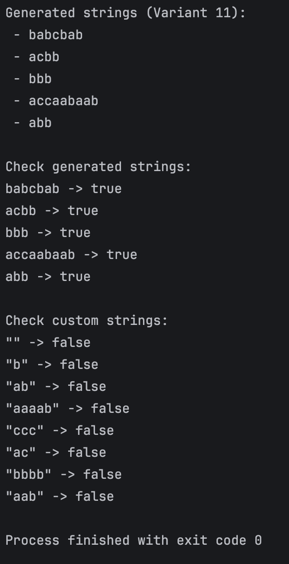

# REGULAR GRAMMAR AND FINITE AUTOMATON
## VARIANT 11

Course: Formal Languages & Finite Automata  
Author: Sofia Ermicev

---

## INTRODUCTION

This laboratory work presents the implementation of a regular grammar and its transformation into a finite automaton. The objective is to demonstrate the equivalence between grammar-based string generation and automaton-based string validation.

---

## THEORY

A formal language is a set of strings defined over a finite alphabet.  
A regular grammar is a Type 3 grammar in the Chomsky hierarchy.

Production rules have the following forms:

A → aB  
A → a

Each non-terminal corresponds to a state in a finite automaton.

---

## GRAMMAR DEFINITION

VN = {S, B, D}  
VT = {a, b, c}  
Start symbol = S

Productions:

S → aB  
S → bB  
B → bD  
B → cB  
B → aS  
D → b  
D → aD

---

## IMPLEMENTATION

### Grammar Class

The Grammar class stores non-terminals, terminals, productions, and the start symbol.  
It generates valid strings by replacing non-terminals according to the production rules.

```
import java.util.*;

public class Grammar {

  private Set<String> nonTerminals; // Vn
  private Set<String> terminals; // Vt
  private Map<String, List<String>> productions; // P
  private String startSymbol; // S

  public Grammar() {
    this.nonTerminals = Set.of("S", "B", "D");
    this.terminals = Set.of("a", "b", "c");
    this.startSymbol = "S";

    this.productions = new HashMap<>();
    this.productions.put("S", List.of("aB", "bB"));
    this.productions.put("B", List.of("bD", "cB", "aS"));
    this.productions.put("D", List.of("b", "aD"));
  }

  public String generateString() {
    Random rnd = new Random();
    String current = startSymbol;

    int maxSteps = 100;
    int steps = 0;

    while (containsNonTerminal(current) && steps < maxSteps) {
      steps++;

      for (int i = 0; i < current.length(); i++) {
        String sym = String.valueOf(current.charAt(i));

        if (nonTerminals.contains(sym)) {
          List<String> rules = productions.get(sym);
          String chosen = rules.get(rnd.nextInt(rules.size()));

          current = current.substring(0, i) + chosen + current.substring(i + 1);
          break;
        }
      }
    }

    if (containsNonTerminal(current)) {
      return generateString();
    }

    return current;
  }

  public List<String> generateStrings(int n) {
    List<String> res = new ArrayList<>();
    for (int i = 0; i < n; i++) {
      res.add(generateString());
    }
    return res;
  }

  private boolean containsNonTerminal(String s) {
    for (int i = 0; i < s.length(); i++) {
      if (nonTerminals.contains(String.valueOf(s.charAt(i)))) {
        return true;
      }
    }
    return false;
  }

  public FiniteAutomaton toFiniteAutomaton() {

    String finalState = "F";

    Set<String> states = new HashSet<>(nonTerminals);
    states.add(finalState);

    Set<Character> alphabet = new HashSet<>();
    for (String t : terminals) {
      alphabet.add(t.charAt(0));
    }

    Map<String, Map<Character, String>> delta = new HashMap<>();

    for (Map.Entry<String, List<String>> entry : productions.entrySet()) {
      String left = entry.getKey();
      for (String right : entry.getValue()) {
        char terminal = right.charAt(0);

        String next;
        if (right.length() == 1) {
          // A → a
          next = finalState;
        } else {
          // A → aB
          next = String.valueOf(right.charAt(1));
        }

        delta.computeIfAbsent(left, k -> new HashMap<>()).put(terminal, next);
      }
    }

    String startState = startSymbol;
    Set<String> finalStates = Set.of(finalState);

    return new FiniteAutomaton(states, alphabet, delta, startState, finalStates);
  }
}

```

---

### FiniteAutomaton Class

This class represents the automaton structure including states, transitions, start state, and final states.

The method stringBelongToLanguage simulates transitions and determines whether the string is accepted.

```
import java.util.Map;
import java.util.Set;

public class FiniteAutomaton {

  private final Set<String> states; // Q
  private final Set<Character> alphabet; // Sigma
  private final Map<String, Map<Character, String>> delta;  // delta
  private final String startState; // q0
  private final Set<String> finalStates; // F

  public FiniteAutomaton(Set<String> states, Set<Character> alphabet,
                         Map<String, Map<Character, String>> delta,
                         String startState, Set<String> finalStates) {
    this.states = states;
    this.alphabet = alphabet;
    this.delta = delta;
    this.startState = startState;
    this.finalStates = finalStates;
  }

  public boolean stringBelongToLanguage(final String inputString) {
    String current = startState;

    for (int i = 0; i < inputString.length(); i++) {
      char ch = inputString.charAt(i);

      if (!alphabet.contains(ch)) {
        return false;
      }

      Map<Character, String> transitions = delta.get(current);
      if (transitions == null) {
        return false;
      }

      String next = transitions.get(ch);
      if (next == null) {
        return false;
      }

      current = next;
    }

    return finalStates.contains(current);
  }
}

```

---

### Main Class

The Main class demonstrates:

1. String generation
2. String validation using the finite automaton

```
import java.util.List;

public class Main {

  public static void main(String[] args) {
    Grammar grammar = new Grammar();

    System.out.println("Generated strings (Variant 11):");
    List<String> words = grammar.generateStrings(5);
    for (String w : words) {
      System.out.println(" - " + w);
    }

    FiniteAutomaton fa = grammar.toFiniteAutomaton();

    System.out.println("\nCheck generated strings:");
    for (String w : words) {
      System.out.println(w + " -> " + fa.stringBelongToLanguage(w));
    }

    System.out.println("\nCheck custom strings:");
    String[] tests = {"", "b", "ab", "aaaab", "ccc", "ac", "bbbb", "aab"};
    for (String t : tests) {
      System.out.println("\"" + t + "\" -> " + fa.stringBelongToLanguage(t));
    }
  }
}

```

---

## RESULTS

The program successfully generates valid strings and verifies them using the finite automaton.

Example output:

aaaaabaaab → true  
aaacbb → true

Custom invalid strings are correctly rejected.


---

## CONCLUSION

This laboratory work confirms the theoretical equivalence between regular grammars and finite automata.  
The implementation demonstrates how grammar production rules correspond directly to automaton state transitions.
